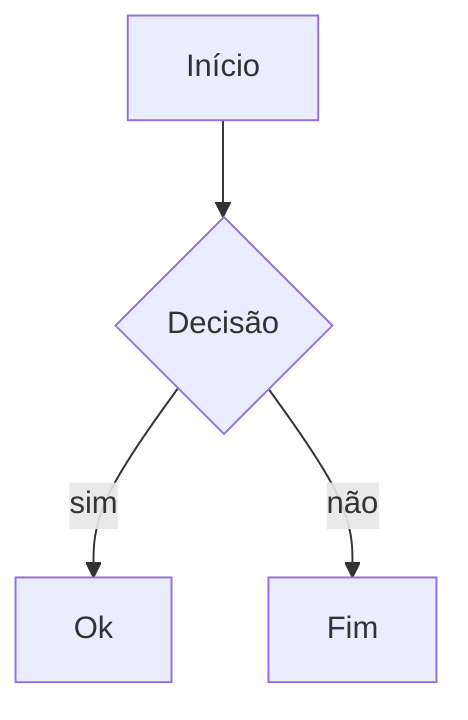

# Meridian — editor de diagramas Mermaid

Editor visual de diagramas **Mermaid** que roda 100% no navegador: **Flowchart, Diagrama ER, Sequência e Classes**.

🔗 **Demo:** https://tiagolxd.github.io/mermaid-viewer/

## Funcionalidades

- ✍️ **Editor com autocomplete e snippets** — comece a digitar e receba sugestões de sintaxe para os 4 tipos de diagrama suportados; destaque de sintaxe e numeração de linhas no gutter.
- 🖼️ **Canvas com layout automático** — o motor de layout organiza o diagrama com 3 modos: hierárquico (camadas), orgânico (forças) e compacto.
- 🔀 **Parser multi-tipo** — detecta e renderiza Flowchart, ER, Sequência e Classes a partir da mesma caixa de texto.
- 🧭 **Minimapa e zoom/pan** — navegue por diagramas grandes com minimapa, zoom e arraste do canvas.
- ↩️ **Undo/redo** — histórico completo de edições.
- 📤 **Exportação** — baixe o diagrama como **SVG**, **PNG** ou o código-fonte **`.mmd`**.
- 🔗 **Compartilhamento por URL** — o diagrama é codificado no link; quem abrir vê exatamente o mesmo desenho.
- 👥 **Colaboração ao vivo** — edite com outras pessoas em tempo real via BroadcastChannel entre abas do mesmo navegador.
- 🌓 **Temas claro/escuro** — alternância entre temas light e dark com persistência no localStorage.
- 📚 **Documentação integrada** — referência completa da linguagem Mermaid ER, Flowchart, Sequência e Classes embutida no app (atalho `?`).
- 🎨 **Formatação de código** — formatação automática do código Mermaid.
- ⌨️ **Atalhos de teclado** — atalhos produtivos para reorganizar (F), modo prévia (P), enquadrar (duplo clique), aplicar código (Ctrl+Enter) e mais.
- 🔒 **Privacidade por padrão** — nenhum dado sai do navegador; tudo roda client-side (localStorage).

## Como usar

1. Abra a [demo](https://tiagolxd.github.io/mermaid-viewer/) (ou rode localmente, abaixo).
2. Escreva o Mermaid no editor à esquerda — ex.:



3. O canvas à direita renderiza em tempo real; ajuste o layout (forças/camadas/compacto), exporte ou copie o link de compartilhamento.

## Rodar localmente

```bash
npm install
npm run dev
```

Build de produção: `npm run build` (gera `dist/`).

## Colaboração

A colaboração funciona via **BroadcastChannel** entre abas do mesmo navegador. Use o parâmetro `?room=<id>` na URL para criar uma sala compartilhada — as edições são sincronizadas em tempo real entre todas as abas com o mesmo room ID.

## Arquitetura

**React é só a casca** (renderiza o mesmo DOM com os mesmos IDs) e o **motor legado roda intacto** — zero reescrita de mecânica, zero regressão.

```
src/
├── App.jsx                  ← monta o EngineHost
├── components/
│   └── EngineHost.jsx       markup do app
└── engine/
    └── engine.js            toda a mecânica: parser multi-tipo, layout,
                              guias, minimapa, snippets, autocomplete,
                              undo, gutter, resize, colaboração...
```

## Segurança

- Nenhum dado sai do navegador por padrão (localStorage)

## Roadmap

- [ ] **Mais tipos de diagrama** — Gantt, State, Pie, Git graph, Mindmap
- [ ] **Templates e galeria** — diagramas de exemplo prontos por categoria
- [ ] **Salvamento local de múltiplos diagramas** — biblioteca de projetos no navegador
- [ ] **Importação** — abrir arquivos `.mmd`/`.svg` por drag & drop
- [ ] **Exportação PDF** e copiar imagem para a área de transferência
- [ ] **Editor de propriedades visual** — editar nós/arestas clicando no canvas (sem digitar Mermaid)
- [ ] **Modo apresentação** — navegar pelo diagrama passo a passo
- [ ] **Refatorar o motor legado em módulos testáveis** — separar `src/engine/engine.js` em unidades puras cobertas por Vitest
- [ ] **Versionamento de diagramas** — histórico de snapshots com diff visual
- [ ] **Colaboração remota** — WebSocket/Supabase para equipe distribuída


## Licença

MIT
